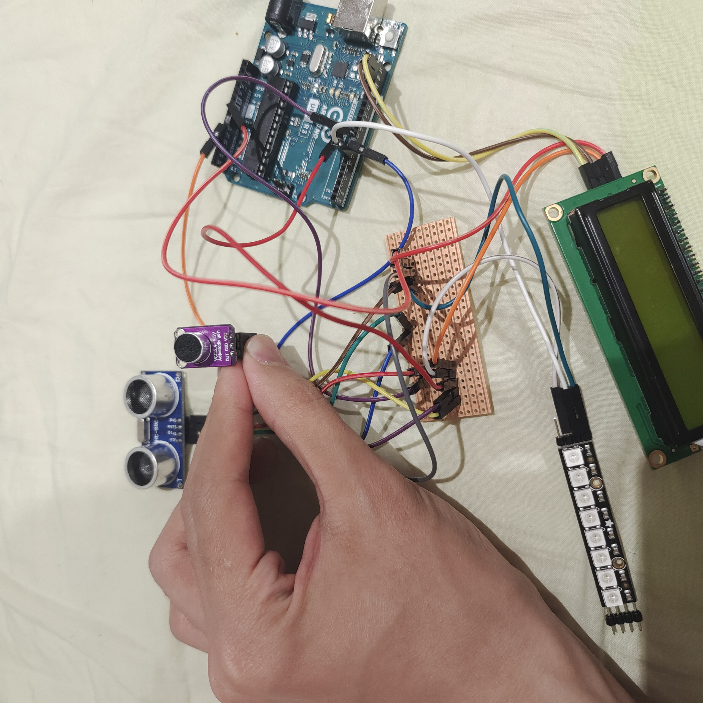
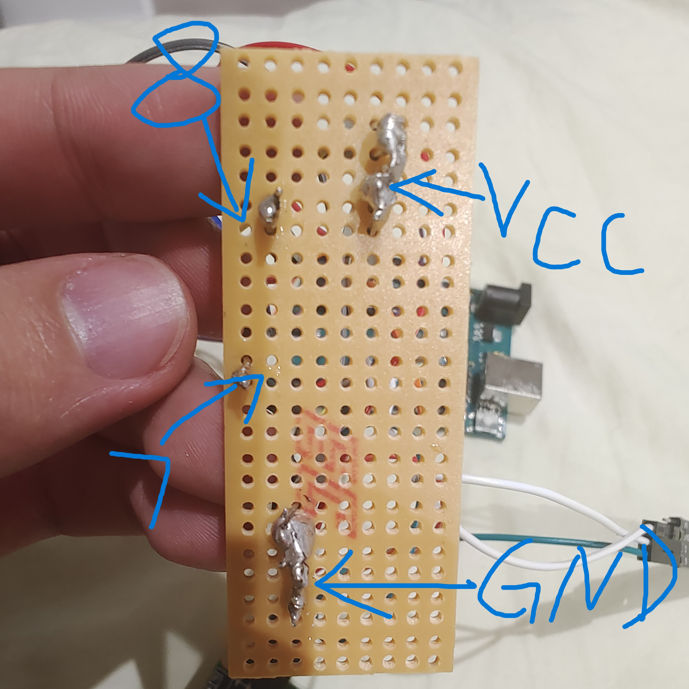
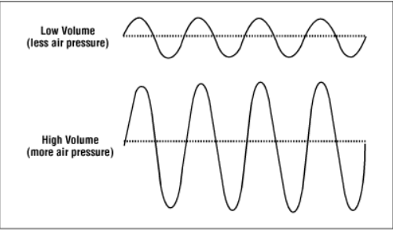
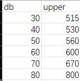
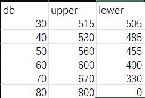
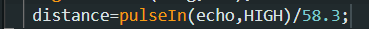
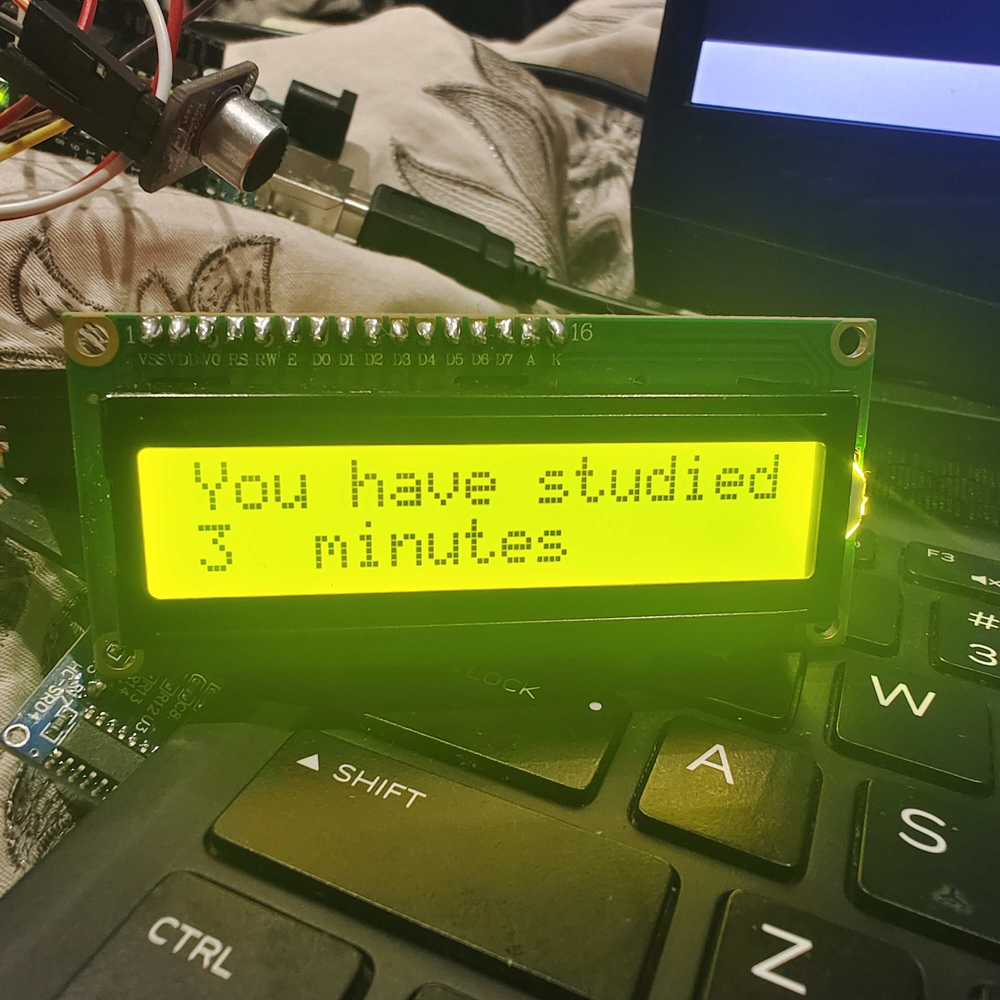
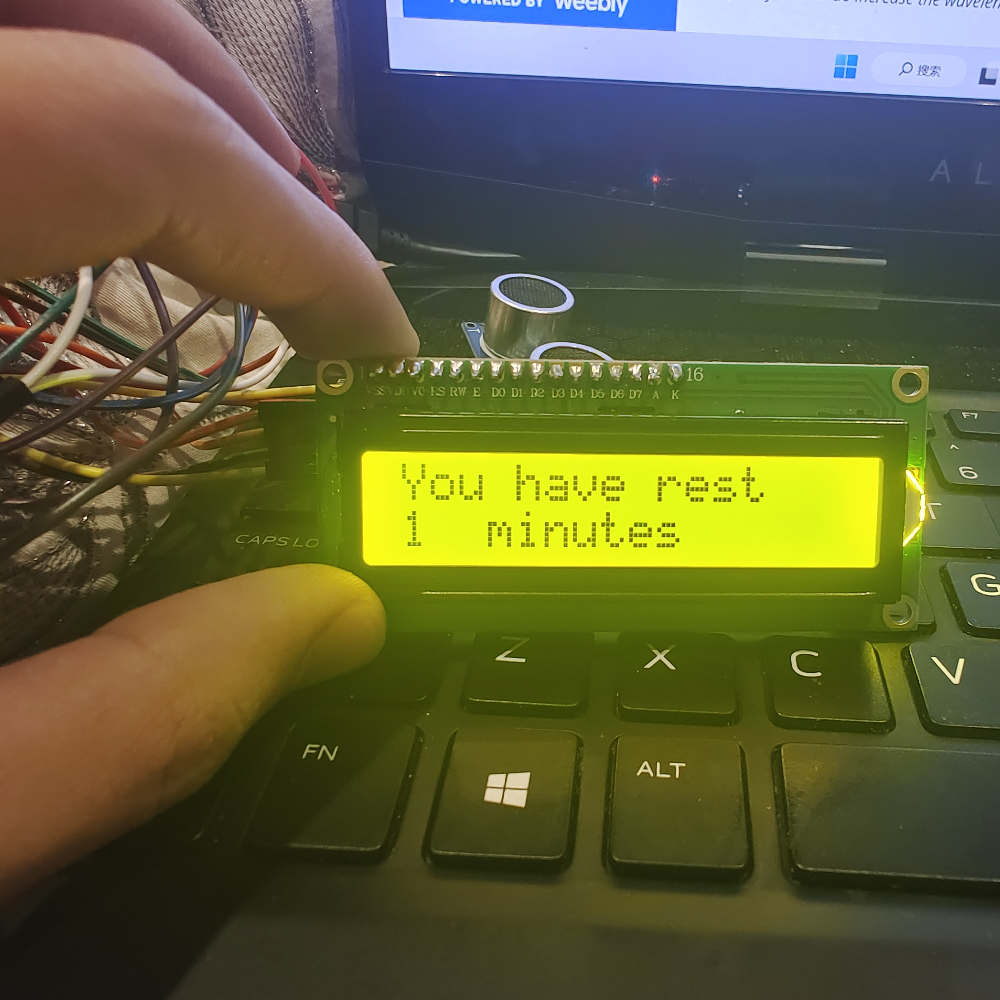

# Library mate
When I studied in the quiet zone of Library last month, I noticed that there were always students talking, and they didn't seem to notice that this behavior had affected the people around them.
Moreover, there was no one to deal with the report on the corresponding link in their library. At the same time, I observed that even if the report was bad, the classmates around did not come out to stop them
Until they get quiet on their own. Therefore, I think it is necessary to build a decibel meter to detect the noise amount of each seat and give feedback to students in some ways when the sound exceeds the set value.

# sensor
1.MAX4466: The MAX4466 is an audio amplifier that amplifies signals from capacitive microphones. The reason for choosing this is that only by using it can the decibel value be output. If you only need to input the high and low level, you can also choose LM393.

2.LCD screen:using to show the real time data .eg:db value or the stay time for a student.

3.arduino: The microcontroller board of this project.

4.ultra sonic sensor: using to test the distance between user and desk, Can detect to check if there is a user in the current position

5.LED strip: will notice user when it detect the sound over the set value.

# how to achive this project
For my project, it can be devided into two parts, the first part is about how to test DB value and the second part is test the stay time of the user.

1. test DB value
In this project, I use the MAX4466, which is an amplifier to receive signal from the micphone. so the key for me is how to transfer the analog number into the DB value. So before I start expain how to transfer it,.  this picture show the relation ship with DB value and the sound wave, which is similar to the analog number I get from the sensor. so my primary design is just focus on the upper bond of the ananlog number.  So that's the data between DB value and Corresponding highest point.  
  
and  I am trying to get a linear regression function so that I can get the correct DB value. But if I use this way to caculate the DB, it won't always be correct. for example, in the quiet environment, like 30DB,the upper bond of analog is read as 515. but even for the 80DB, there must be someplace have the analog read is 515. so it's hard to distinguish if the sensor get the highest value. So I consider a new way to solve it. so in this time, I also got the lower bond for special DB value, which is show below.  
   
Meanwhile, I found the requirement of library usually be 35-40 DB,  so according to the sheet,  I use the sensorVal over 600 and lower than 450 as the warning line. So in that case, if someone talk aloud in the library, it will be warning by the light and the LCD board will notice him the current DB value is over 40 DB so that user can get reflection from it. Compare with the primary design, the advantage of using this way is much reliable, if the light is shining, which means the DB value now must exceed the set vaule. But also, it may runs slow or miss some useful data because we can not make sure the data we received from sensor are always be useful.
2. Test the current stay time in the seat.
 
This idea is inspired from the presentation last time.  We all know that set for a long while may need time to have a rest. so I will test the distance between user and desk and set up a timer to notice user. In order to help understanding, so I convert the data I got through this equation, which can help me to get the distance in cm. But when I testing on this sensor, I find there might be some error number, which distance is over 10 meters. So in this program it won't be seem as a useful number. After you have stay here over 60 minutes, the lcd board will advise you to have a rest and continue to count the time you have leave, which can help you to get better work life balance.

# output when running the code

# Project goal
My project goal is to arrange this decibel meter in the library of ucl east, which can detect the decibel value within a certain range. When the decibel value is higher than the set value, users at the location can be prompted through the led strip or lcd board.
The decibel values were then transmitted through the mqtt protocol and analyzed using influxdb and grafana tools. If the decibel value is higher than the set value for a long time, manual maintenance can be carried out by adding administrators.

